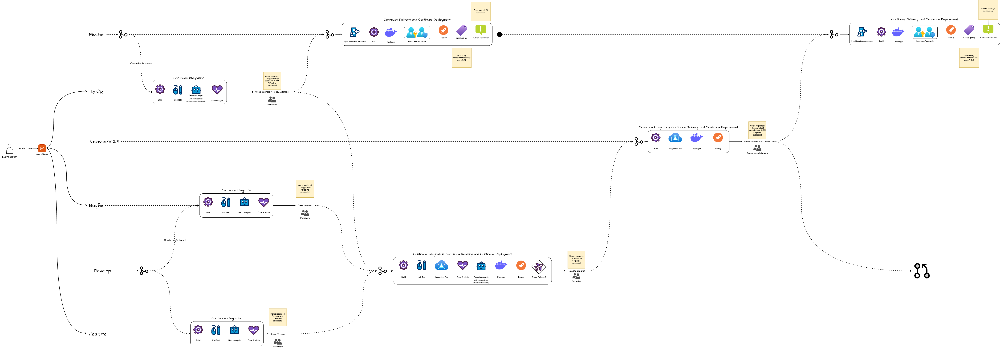

#CI/CD Microservicios :computer:

En esta sección explicaré el flujo CI/CD de los microservicios backend. Para esto primero debemos dar un contexto general...

##Contexto tecnologico
Nuestros microservicios se encuentran en **Java 17** desarrollados bajo el framework **springboot en su versión 3.2.3** usando **Maven en su versión X.X**; nuestro computo en nube  es **ECS con Fargate en su versión 1.4**.

Dado este contexto, podemos proseguir con la explicación 📀.

El flujo de los pipelines es muy sencillo, se comprende básicamente de acciones detonadas en cada una de las ramas principales de GitFlow; es decir, tenemos ramas feature/x, develop, release/vX.X.X, master, bugfix y hotfix. Nuestras ramas continuas son develop y master, es decir son ramas las cuales **nunca** serán eliminadas ☠️ (por nada del mundo); las demás ramas se trata de ramas dinámicas en el tiempo, las cuales cumplen con su función de integración/despliegue y su finalidad es ser eliminadas.

###Ejemplo

Como desarrollador voy a implementaré una nueva feature sobre el microservicio de clientes, para esto creo la rama **feature** desde la rama **develop**; el nombramiento de la rama feature debe ser con el ID de la HU o HT que se va implementar, es decir si en el tablero está asignada la HU-293, entonces la rama feature deberá ser nombrada de la siguiente manera: **feature/HU-293**

##Explicación del flujo CI/CD

###Flujo

!!! question
    Si ves el gráfico muy pequeño, prueba haciendo zoom-in en tu navegador o haciendo click [aquí](https://drive.google.com/file/d/1G1IyN_RnOchOk8Fm67DyuH5YLYAQgPeV/view?usp=sharing).

1. **Para las ramas feature/x:** Para estas ramas únicamente se hace CI, debido a que no contamos con ningún ambiente en nube para realizar despliegues. Primero se realiza un build, luego se realiza ejecución de test unitarios, se realiza un análisis de seguridad el cual analiza toda la rama actual en busqueda de malas configuraciones o dependencias con vulnerabildiades y por último se realiza un análisis del estado del código más a nivel de code smells, cobertura del código y demás con SonarQube. Una vez el pipeline se haya ejecutado y todo esté OK tanto en el análisis de seguridad como en el SonarQube, es necesario que se cree el PR de la feature en cuestión hacia develop.

    !!! note
        Recuerda que para conocer un poco más sobre las reglas de creación de **release** y el **versionamiento semántico** puedes dar click [aquí](semver.md)

2. **Para las rama develop:** Para estas ramas se realiza CI y CD; el CI es casi el mismo que en una rama feature pero con el cambio que el análisis de seguridad se realiza únicamente en el **pom.xml**, esto debido a que no tiene sentido nuevamenete analizar toda la rama puesto que partimos del hecho que todo lo depositado en la rama develop ya ha pasado los checks de seguridad anteriores. Respecto al CD, se realiza la extracción del JAR, con este se genera una imagen de contenedor basada en amazon coretto 17, dicha imagen de contenedor se sube a ECR y se realiza una iteración de la task definition en ECS apuntando a la nueva imagen subida en ECR, por último se realiza el nuevo despliegue. Como mejora futura está el consultar la versión desplegada en la ruta de health que cada microservicio tiene disponible, de esta manera nos aseguramos consultando la versión del microserivicio.

    1. **Condiciones de aceptación del PR:**
        1. Se debe garantizar la revisión par, es decir otro desarrollador diferente al dueño del último commit y de la rama debe aprobar el PR. 
        2. No deben haber comentarios abiertos dentro del PR, estos hacen referencia a los mensajes que dejan los demás dentro de nuestro PR indicando mejoras o dudas.
        3. El pipeline de la feature se debió haber ejecutado sin ningún error, de esta manera garantizamos que nuestro análisis de seguridad no denotó nada sospechoso y que cumplimos con el quality gate de SonarQube.
        4. Nuestro PR debe tener un título adecuado para el versionamiento semántico y estar de la mano con los cambios realizados.
        5. Si vamos a crear un release, debemos seguir el proceso de creación de release puedes dar click [aquí](semver.md)

3. **Para las rama release/vX.X.X:** En las ramas release se realiza tanto el proceso de CI como el de CD, la diferencia es que esta rama es dinámica y debe ser eliminada una vez se cumpla el merge a master. Además de que en esta rama no se realiza ningún análisis de seguridad. El merge de esta rama a master sólo se da una vez el equipo de calidad haya garantizado que todo lo que está en este ambiente en el release corriente es adecuado para salir a producción. También se pretende acoplar a diferentes tipos de tests como lo son de integración con runners que garanticen que el flujo no se rompa.

    1. **Condiciones de aceptación del PR:**
        1. Se debe garantizar la revisión por parte del equipo de desarrollo, se debe contar con 2 aprobaciones diferentes al dueño del último commit.
        2. No deben haber comentarios abiertos dentro del PR, estos hacen referencia a los mensajes que dejan los demás dentro de nuestro PR indicando mejoras o dudas.
        3. El pipeline de develop se debió haber ejecutado sin ningún error, de esta manera garantizamos que nuestro análisis de seguridad no denotó nada sospechoso y que cumplimos con el quality gate de SonarQube.

4. **Para las rama master:** Esta es la rama principal de cada repositorio, lo que esté en esta rama es lo que está en paralelo en el ambiente de producción. En esta rama respecto al pipeline, únicamente se realiza un proceso de CI limitado a contrucción y generación de la imagen de contenedor; se completa con una etapa de CD la cual realiza la entrega y el despliegue en la cuenta de producción. Finalizando dicho proceso, se realiza un git tag de acuerdo a la versión dada por nuestro versionamiento semántico.

    1. **Condiciones de aceptación del PR:**
        1. Se debe garantizar la revisión por parte del equipo de QA y la validación por parte del equipo de desarrollo.
        2. No deben haber comentarios abiertos dentro del PR, estos hacen referencia a los mensajes que dejan los demás dentro de nuestro PR indicando mejoras o dudas.
        3. El pipeline de release se debió haber ejecutado sin ningún error, de esta manera garantizamos que nuestro análisis de seguridad no denotó nada sospechoso y que cumplimos con el quality gate de SonarQube.

COMPLETAR CON HOTFIX y BUGFIX